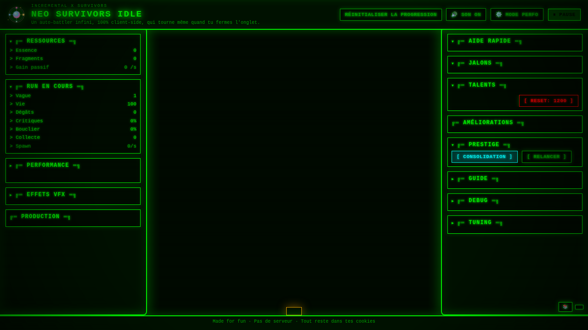

# Neo Survivors Idle

[](https://github.com/npiron/SolarSystem/actions/workflows/test.yml)
[](https://github.com/npiron/SolarSystem/actions/workflows/deploy-pages.yml)
[](https://github.com/npiron/SolarSystem/actions/workflows/release.yml)
[](LICENSE)
[](../../wiki)

> A 100% client-side incremental auto-battler game. No server required – all progress is saved in your browser via `localStorage`.



*Game interface showing resource panels (left), combat arena (center), and upgrades (right)*

## ✨ Features

- 🎮 **Full auto-battler** - Character moves and shoots automatically
- 💾 **Client-side only** - No server, runs entirely in your browser
- ⚡ **Infinite waves** - Endless enemy waves with increasing difficulty
- 🔄 **Prestige system** - Soft reset with permanent bonuses (Consolidation)
- 🌳 **Talent tree** - Persistent synergies and upgrades
- 🏭 **Idle production** - Passive resource generation continues offline
- 🎯 **Performance mode** - Optimized for hundreds of active entities
- 📱 **Responsive UI** - Works on desktop and mobile browsers

## 🚀 Quick Start

### Play Online

Visit the [live demo on GitHub Pages](https://npiron.github.io/SolarSystem/) (if deployed)

### Run Locally

```bash
# Option 1: Open index.html directly
open index.html

# Option 2: Use a local server
python -m http.server 8000
# Then visit http://localhost:8000

# Option 3: Development mode with hot reload
npm install
npm run dev
```

## 📖 Documentation

Comprehensive game documentation is available in the [**GitHub Wiki**](../../wiki):

- 🚀 [Quick Start Guide](../../wiki/D%C3%A9marrage-Rapide) - How to launch and play
- ⚔️ [Combat System](../../wiki/Syst%C3%A8me-de-Combat) - Combat mechanics
- 💰 [Resources & Economy](../../wiki/Ressources-et-%C3%89conomie) - Resource management
- 🏭 [Generators](../../wiki/G%C3%A9n%C3%A9rateurs) - Passive production
- ⬆️ [Upgrades](../../wiki/Am%C3%A9liorations) - Combat upgrades
- 🌳 [Talent Tree](../../wiki/Arbre-de-Talents) - Persistent synergies
- ⟳ [Prestige](../../wiki/Prestige-Consolidation) - Consolidation system
- ❓ [FAQ](../../wiki/FAQ) - Frequently asked questions

## 🎮 How to Play

- ⚡ **Essence**: Generated passively by buildings (Drones, Forge, Spires). Invest to increase production rate
- ✦ **Fragments**: Dropped in combat, materialized as collectible orbs in the arena. Use for offensive upgrades
- 🌊 **Infinite Waves**: Arena HUD shows current wave, kills, and resources gained
- ⟳ **Consolidation**: Soft prestige with cooldown that resets waves but grants permanent multipliers
- ☠️ **Death & Restart**: When HP reaches zero, run pauses with "Restart Run" button
- 🎯 **Criticals & Rotating Fire**: Projectiles rotate around hero and can deal massive critical hits
- 🧿 **Defense & Control**: Upgrades add shields, piercing, range, and collection magnet
- 🚀 **Performance Mode**: Reduces visual effects and groups floating gains for better performance

All progress auto-saves every few seconds to `localStorage`. No backend required.

## 🛠️ Development

### Prerequisites

- Node.js 18+ (v20 recommended - see `.nvmrc`)
- npm 9+

### Installation

```bash
# Clone the repository
git clone https://github.com/npiron/SolarSystem.git
cd SolarSystem

# Install dependencies
npm install
```

### Available Scripts

```bash
npm run dev         # Start development server with hot reload
npm run build       # Build for production
npm run preview     # Preview production build
npm test            # Run tests with coverage
npm run test:watch  # Run tests in watch mode
npm run typecheck   # Type check TypeScript files
```

### Project Structure

```
.
├── index.html           # Main entry point
├── src/                 # Source code
│   ├── config/         # Game configuration and data tables
│   ├── systems/        # Game systems (combat, economy, progression)
│   ├── renderer/       # Rendering utilities
│   └── types/          # TypeScript type definitions
├── tests/              # Test files (Vitest)
├── public/             # Static assets
│   └── assets/         # Images, styles
└── examples/           # Demo and example files
```

### Technology Stack

- **TypeScript** - Type-safe JavaScript
- **Vite** - Fast build tool and dev server
- **PixiJS** - WebGL/Canvas 2D rendering
- **Tailwind CSS** + **DaisyUI** - Styling
- **Vitest** - Unit testing
- **localStorage** - Client-side persistence

## 🚀 Deployment

### GitHub Pages

The repository includes GitHub Actions workflows for automatic deployment:

1. Go to **Settings > Pages** in your repository
2. Set **Source** to **GitHub Actions**
3. Push to `main` or `work` branch
4. The site will be available at `https://<username>.github.io/<repo-name>/`

### Manual Deployment

```bash
# Build the project
npm run build

# Deploy the dist/ folder to your hosting service
# Or serve index.html + assets directly (no build needed)
```

## 🤝 Contributing

Contributions are welcome! Please read our [Contributing Guidelines](CONTRIBUTING.md) before submitting a pull request.

1. Fork the repository
2. Create a feature branch (`git checkout -b feature/amazing-feature`)
3. Commit your changes (`git commit -m 'Add amazing feature'`)
4. Push to the branch (`git push origin feature/amazing-feature`)
5. Open a Pull Request

Please ensure:
- ✅ Tests pass (`npm test`)
- ✅ Types are valid (`npm run typecheck`)
- ✅ Build succeeds (`npm run build`)
- ✅ Code follows existing style conventions

## 📋 CI/CD & Automation

- **Tests**: Runs on `main`, `work` branches and PRs via `npm ci && npm test`
- **Pages**: Auto-deploys to GitHub Pages on push to `main` or `work`
- **Releases**: Pushing tag `v*.*.*` creates GitHub Release with automatic notes
- **Wiki Sync**: Syncs `wiki/` folder to GitHub Wiki (see workflow for setup)
- **Dependabot**: Weekly dependency updates (npm & GitHub Actions)

See [RELEASE_PROCESS.md](RELEASE_PROCESS.md) for versioning and release procedures.

## 🎯 Canvas & Rendering Alternatives

This project uses PixiJS for rendering. Other options for browser game development:

| Technology | Description | Use Case |
|------------|-------------|----------|
| **WebGL** | Low-level GPU rendering API | High-performance 2D/3D games |
| **WebGPU** | Next-gen GPU API (in development) | Advanced 3D, GPU compute |
| **SVG** | Vector graphics with CSS/JS | Simple games, UI elements |
| **CSS 3D** | CSS transforms and animations | Card games, light puzzles |
| **DOM** | Direct DOM manipulation | Prototypes, casual games |

### Popular Frameworks

- **[Three.js](https://threejs.org/)** - 3D WebGL engine
- **[Babylon.js](https://www.babylonjs.com/)** - Full 3D engine with physics
- **[Phaser](https://phaser.io/)** - Popular 2D Canvas/WebGL framework
- **[Godot HTML5](https://godotengine.org/)** - Full game engine with WebAssembly export
- **[Unity WebGL](https://unity.com/)** - Unity games in browser via WebAssembly

PixiJS provides an excellent balance of WebGL performance and ease of use for 2D games while remaining 100% client-side.

## 🎨 Performance Features

- **Spatial hash** for efficient collision detection
- **Object pooling** for projectiles and particles
- **Performance mode** button to reduce visual effects
- **Budgets** to limit active projectiles and particles
- **Grouped gain ticker** for reduced UI updates

## 📄 License

This project is licensed under the Apache License 2.0 - see the [LICENSE](LICENSE) file for details.

## 🔒 Security

See [SECURITY.md](SECURITY.md) for security policy and vulnerability reporting.

## 📜 Code of Conduct

This project follows the [Contributor Covenant Code of Conduct](CODE_OF_CONDUCT.md). By participating, you are expected to uphold this code.

## 🙏 Acknowledgments

- Built with [PixiJS](https://pixijs.com/)
- UI components from [DaisyUI](https://daisyui.com/)
- Inspired by Vampire Survivors and other auto-battler games

---

**Enjoy the game!** If you encounter any issues or have suggestions, please [open an issue](../../issues).
